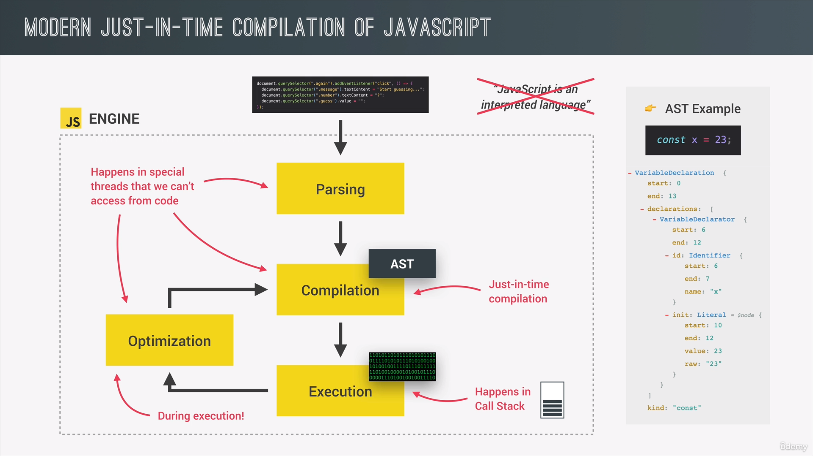
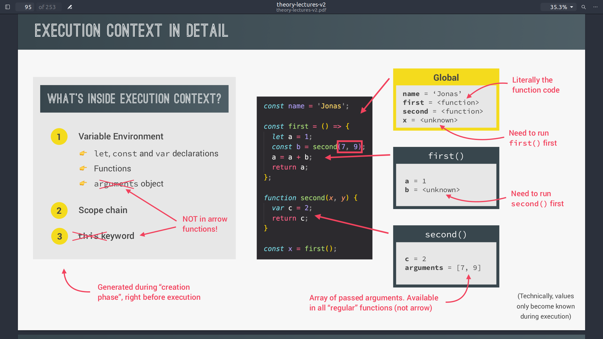
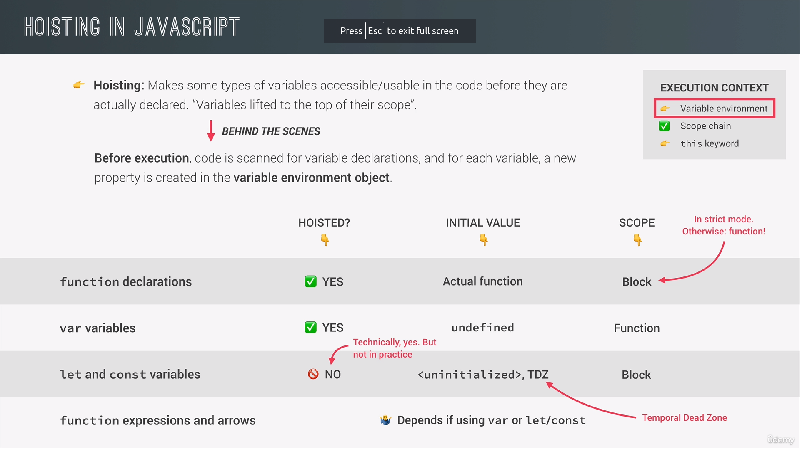

# Js Behind The Scenes

---

[TOC]


## Js Engine and Runtime

#### What Compiler Do 🚀?

 1. take the whole code
 2. convert it to machine code
 3. then store it in portable binary file
 4. Then Execution


#### What Interpreter do ? 🚀

1. take one line of code
2. Execute it, but after converting it to machine code
3. then take next line 


#### What Just-In-Time Compiler do (JIT) ? 🚀

1. take the whole code
2. convert it to machine code
3. executes without storing it in a portable file


#### How Js process its code by the engine, or How it does JIT?

1. First Parse or read the code 

2. convert the code to **Abstract Syntax Tree** (AST)

3. Compile the converted code without making a portable file (JIT)

4. Execute the code

5. optimize the executed maching code and recompile then execute           

                              

---



---

## Scopes 🚀

### Global Scope

### Block Scope

1. let, const, and function Declarations are block scoped but var isn't

2. var is function scoped , meaning it can be accessed out side if or loop block even if it is declared inside , but this doesn't apply to function

   ```javascript
   
   function func(){
       function func2(){//function scope
           if(true){// block scope
               const ahmed="ali";
               var ali="ahmed";
           }
           console.log(ali);// works because var is function scope
           console.log(ahmed);// doesn't work
       }
       console.log(ali);// doesn't work because its functionally scoped
   }
   ```

   ---

## Hoisting ✨✨

* Making some types accessed before being declared 

* **HOW** ❓ By Simple scanning the whole code first searching for variable declarations then put them in variable environment object

  

* **What is TDZ** ❓ the place between the beginning of scope and the declaration of the variable for unhoisted types like let, const 🚀, error message is uninitiaized

  
