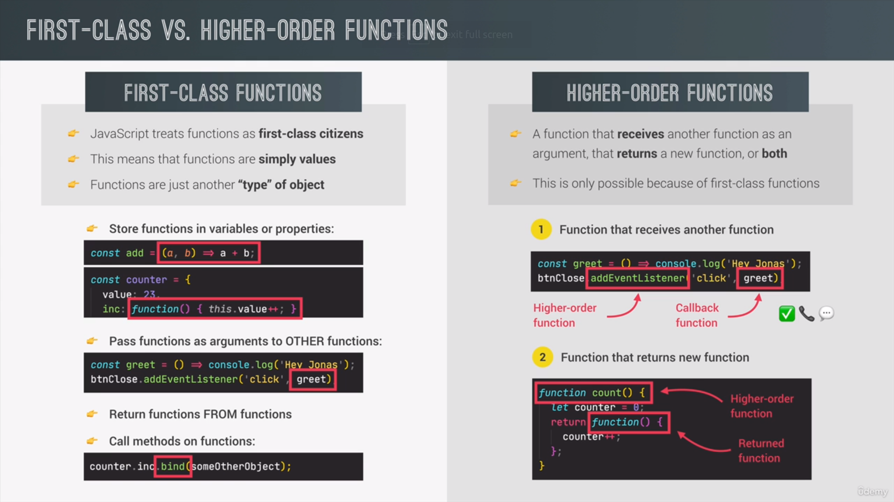

<!-- TOC -->

- [-Functions](#-functions)
  - [Default Parameters ⭐](#default-parameters-)
  - [Passing Reference vs value type 🧭](#passing-reference-vs-value-type-%F0%9F%A7%AD)
  - [First Class vs Higher order function 📓](#first-class-vs-higher-order-function-) - [Just a theory video return to slides 🌲](#just-a-theory-video-return-to-slides-)
  - [Accepting a callback function 🚀](#accepting-a-callback-function-)
  - [Function return function 🙃](#function-return-function-)
  - [Apply, call and **bind** Method 🛩️](#apply-call-and-bind-method-)

<!-- /TOC -->

# 10-Functions

## Default Parameters ⭐

```js
//  If You put default value it will override undefined type

const defaultParam = function (a = 20, b = 15, c = 2 * b) {
  console.log(a, b, c);
};
defaultParam(5, undefined, 15); // 5, 15
defaultParam(undefined, undefined, undefined);
defaultParam(5, 15, undefined); // 5, 15, 2*b=30
```

## Passing Reference vs value type 🧭

```js
// If you pass primitive then value is copied to different variable
// If you pass object then reference to the value is copied
const myName = 'Ahmed';
const person = {
  myName: 'khalid',
  myArr: [1, 2, 3, 5, 16],
};
const changeNames = function (val, ref) {
  val = 'Ismail';
  ref.myName = 'ali';
  ref.myArr = [20, 40];
};
console.log(myName, person.myName, ...person.myArr); // Ahmed Khalid
// changeNames(myName, person);
// console.log(myName, person.myName);// Ahmed Ali
// object value changed
// To avoid object value changing ⭐⭐
changeNames(myName, { ...person });
console.log(myName, person.myName, ...person.myArr);
```

## First Class vs Higher order function 📓

#### Just a theory video return to slides 🌲

- Higher Order function is a function which:
  1. I can pass function as an argument in as a callback
  2. I can return function From
  3. Care More about what not the how
  4. Allow us to create interfaces



## Accepting a callback function 🚀

```js
const oneWord = function (str) {
  return str.replaceAll(' ', '').toLowerCase();
};
const firstUpper = function (str) {
  const [first, ...other] = str.split(' ');
  return [first.toUpperCase(), ...other].join(' ');
};

// Notice that transform is a generic function [interface]
// [reflect] on factory Design Pattern 🤔

const transform = function (str, func) {
  // higher Order Function
  console.log(func(str));
  console.log(func.name);
};
transform('ahmed Kashkoush', oneWord);
transform('ahmed Kashkoush', firstUpper);
```

## Function return function 🙃

```js
const great = function (greating) {
  return function (name) {
    console.log(`${greating}, ${name}`);
  };
};
// ! This is important for function programming paradigm
great('Hey')('khalid');
// great('Hey') is the returned function
// you can pass to the returned funciton the name
// As an arrow
const greatArrow = greating => name => console.log(`${greating}, ${name}`);
```

## Apply, call and **bind** Method 🛩️

```js
const person1 = {
  firstName: 'Ahmed',
  secondName: 'Kashkoush',
  printFullName(str, age) {
    console.log(`${this.firstName} ${this.secondName} age:${age}, str:${str}`);
  },
};
person1.printFullName();
const person2 = {
  firstName: 'Khalid',
  secondName: 'Rabee',
};
// I want to use printFullName on person2 without coping it to person 2
// How 🤔
// Solution ⭐⭐⭐
person1.printFullName.call(person2, 'hi', 27); // Khalid Rabee age:27, str:hi
person1.printFullName.apply(person2, ['hi', 27]); // apply accept array arguments
// only works if with same property names
// 🔴🔴 I've manipulated this keyword 😎😎

// bind
const print = person1.printFullName.bind(person2); // this arguments will never change
print('hello', 50); // will use the preset arguments

// bind is important for setting this without calling the function
// [Explanation]🌃
const cairoAirPort = {};
cairoAirPort.planes = 50; // planes in the airport;
// I want to make function that buy new Plan
cairoAirPort.buyPlane = function () {
  console.log(this);
  this.planes++;
  console.log(this.planes);
};

// I want to call function when click on the button
document
  .querySelector('.buy')
  .addEventListener('click', cairoAirPort.buyPlane.bind(cairoAirPort));

// without using the bind method ==> will use the button this, not object this
// why didn't use call, or apply
// --> will call the function and I need callback
// ⭐⭐⭐ use bind method to set this keyword and without calling the funciton
```
