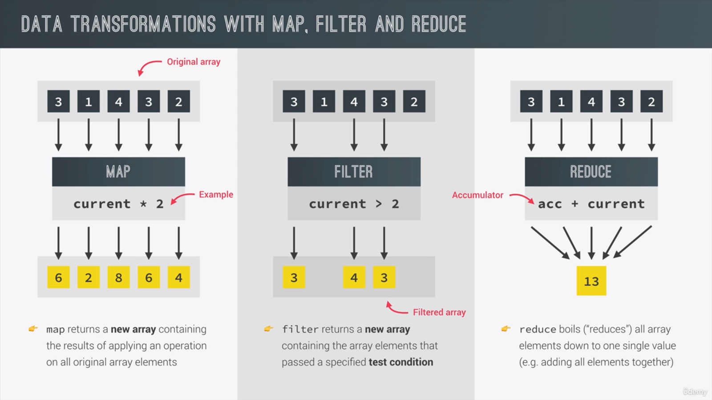

# 11-Working with Arrays
- [[#coding challenge 1|coding challenge 1]]
- [[#Map, Filter, and reduce|Map, Filter, and reduce]]
- [[#Coding Challenge 2|Coding Challenge 2]]
- [[#The Magic of chaining Methods|The Magic of chaining Methods]]
		- [[#Coding Challenge 3|Coding Challenge 3]]
- [[#flat, flatmap|flat, flatmap]]
- [[#Sorting In JS|Sorting In JS]]
- [[#Filling Arrays|Filling Arrays]]
- [[#Summary|Summary]]


## coding challenge 1

```js
/*
Julia and Kate are doing a study on dogs. So each of them asked 5 dog owners about their dog's age, and stored the data into an array (one array for each). For now, they are just interested in knowing whether a dog is an adult or a puppy. A dog is an adult if it is at least 3 years old, and it's a puppy if it's less than 3 years old.

Create a function 'checkDogs', which accepts 2 arrays of dog's ages ('dogsJulia' and 'dogsKate'), and does the following things:

1.✅ Julia found out that the owners of the FIRST and the LAST TWO dogs actually have cats, not dogs! So create a shallow copy of Julia's array, and remove the cat ages from that copied array (because it's a bad practice to mutate function parameters) 2. Create an array with both Julia's (corrected) and Kate's data 3. For each remaining dog, log to the console whether it's an adult
("Dog number 1 is an adult, and is 5 years old") or a
puppy ("Dog number 2 is still a puppy 🐶") 4. Run the function for both test datasets

HINT: Use tools from all lectures in this section so far 😉

TEST DATA 1: Julia's data [3, 5, 2, 12, 7], Kate's data [4, 1, 15, 8, 3]
TEST DATA 2: Julia's data [9, 16, 6, 8, 3], Kate's data [10, 5, 6, 1, 4]

GOOD LUCK
\*/

const checkDogs = function (dogsJulia, dogsKate) {
  // const dogsJuliaCorrected = dogsJulia.slice(1, -2);
  console.log(...dogsJuliaCorrected);
  const dogs = dogsJuliaCorrected.concat(dogsJulia);
  // console.log(...arr2);
  dogs.forEach(function (dog, i) {
    console.log(
      `Dog number ${i} ${
        dog >= 3
          ? `is and adult, and is ${dog} years old`
          : `is still a puppy 🐶`
      }`
    );
  });
};
checkDogs([3, 5, 2, 12, 7], [4, 1, 15, 8, 3]);
console.log('〰️〰️〰️〰️〰️〰️Test 2 〰️〰️〰️〰️〰️〰️〰️');
checkDogs([9, 16, 6, 8, 3], [10, 5, 6, 1, 4]);
```

## Map, Filter, and reduce



## Coding Challenge 2

```js
/*

Let's go back to Julia and Kate's study about dogs. This time, they want to convert dog ages to human ages and calculate the average age of the dogs in their study.

  

Create a function 'calcAverageHumanAge', which accepts an arrays of dog's ages ('ages'), and does the following things in order:

  

1.✅ Calculate the dog age in human years using the following formula: if the dog is <= 2 years old, humanAge = 2 * dogAge. If the dog is > 2 years old, humanAge = 16 + dogAge * 4.

2.✅ Exclude all dogs that are less than 18 human years old (which is the same as keeping dogs that are at least 18 years old)

3. ✅Calculate the average human age of all adult dogs (you should already know from other challenges how we calculate averages 😉)

4.✅ Run the function for both test datasets

  

TEST DATA 1: [5, 2, 4, 1, 15, 8, 3]

TEST DATA 2: [16, 6, 10, 5, 6, 1, 4]

  

GOOD LUCK 😀

*/

const calcAverageHumanAge=function(ages){

const humanAges=ages.map(function(age){

if(age<=2)return age*2;

return 16+age*4;

});

const adults=humanAges.filter((age)=>age>=18);

return adults.reduce(((acc, cur,i,arr)=>acc+cur/arr.length),0);

  
  

}

// console.log(calcAverageHumanAge( [5, 2, 4, 1, 15, 8, 3]));

console.log(calcAverageHumanAge( [16, 6, 10, 5, 6, 1, 4]));
```

## The Magic of chaining Methods
1. **It is a bad Practice to chain methods that mutate the array**
	1. This way You Are making it harder to debug this array in the future
 #### Coding Challenge 3 
 * [[#Coding Challenge 2|Coding Challenge 2]]
 
 ```js
   /* rewrite the coding challenge 2

1. Use Arrow functions

2. Use chaining Methods

  

*/
const calcAverageHumanAge=function(ages){
return ages
	.map((age)=>(age<=2?age*2:16+age*4))
	.filter((age)=>age>=18)
	.reduce(((acc, cur, i, arr)=>acc+cur/arr.length), 0)
}

console.log(calcAverageHumanAge( [5, 2, 4, 1, 15, 8, 3]));

console.log(calcAverageHumanAge( [16, 6, 10, 5, 6, 1, 4]));

```

## flat, flatmap
```js


// What Do I want, I need sum all array movements

// to do so I need to collect them in one big array

// and then sum them

// to so I can use flat(nestingDepth)

// flatmap=map()+flat(1); in the same order

  

const totalMovements=accounts

.map(acc=>acc.movements)

.flat(1)

.reduce((acc, cur)=>acc+cur, 0);

console.log(totalMovements);
```


## Sorting In JS
1. arr.sort()=> Converts elemnts to string and combare based on that, which is **lexigrophically**
2. so You need to specify a condition 
```
  You want a before b ==> condition return >0
  you want b before a ==> condition return <0
 
```

## Filling Arrays 
* ⭐Very Important **querySelectorAll** returns a nodeList , that's why you can's use map on it
```js
// array.fill(value, from, to)

const x=new Array(7).fill(1, 3);

// console.log(x);

// array.from(initialArray, callback to fill it with)

const y=Array.from({length:7}, ()=>1);

console.log(y);

  

// If you don't use an argument put _


```
## Summary
![[arraySummary.png]]
  
## Coding Challenge 4
```js

/*

Julia and Kate are still studying dogs, and this time they are studying if dogs are eating too much or too little.

Eating too much means the dog's current food portion is larger than the recommended portion, and eating too little is the opposite.

Eating an okay amount means the dog's current food portion is within a range 10% above and 10% below the recommended portion (see hint).

  

1.✅ Loop over the array containing dog objects, and for each dog, calculate the recommended food portion and add it to the object as a new property. Do NOT create a new array, simply loop over the array. Forumla: recommendedFood = weight ** 0.75 * 28. (The result is in grams of food, and the weight needs to be in kg)

2. ✅Find Sarah's dog and log to the console whether it's eating too much or too little. HINT: Some dogs have multiple owners, so you first need to find Sarah in the owners array, and so this one is a bit tricky (on purpose) 🤓

3. ✅Create an array containing all owners of dogs who eat too much ('ownersEatTooMuch') and an array with all owners of dogs who eat too little ('ownersEatTooLittle').

4. ✅Log a string to the console for each array created in 3., like this: "Matilda and Alice and Bob's dogs eat too much!" and "Sarah and John and Michael's dogs eat too little!"

5.✅ Log to the console whether there is any dog eating EXACTLY the amount of food that is recommended (just true or false)

6.✅ Log to the console whether there is any dog eating an OKAY amount of food (just true or false)

7. ✅ Create an array containing the dogs that are eating an OKAY amount of food (try to reuse the condition used in 6.)

8.✅ Create a shallow copy of the dogs array and sort it by recommended food portion in an ascending order (keep in mind that the portions are inside the array's objects)

  

HINT 1: Use many different tools to solve these challenges, you can use the summary lecture to choose between them 😉

HINT 2: Being within a range 10% above and below the recommended portion means: current > (recommended * 0.90) && current < (recommended * 1.10). Basically, the current portion should be between 90% and 110% of the recommended portion.

  

TEST DATA:

  

GOOD LUCK 😀

*/

const dogs = [

{ weight: 22, curFood: 250, owners: ['Alice', 'Bob'] },

{ weight: 8, curFood: 200, owners: ['Matilda'] },

{ weight: 13, curFood: 275, owners: ['Sarah', 'John'] },

{ weight: 32, curFood: 340, owners: ['Michael'] }

];

// 1.

dogs.forEach(function(dog){

dog.recommendedFood=(dog.weight)**.75*28;

console.log(dog);

});

// 2.

const dogObj=dogs

.find((dog)=>dog.owners.includes('Sarah'));

console.log(dogObj?.curFood>dogObj?.recommendedFood? 'Too Much':'Too Little');

// 3.

const isTooLittle=dog=>dog.curFood<dog.recommendedFood;

const isTooMuch=dog=>dog.curFood>dog.recommendedFood;

const ownersEatTooLittle=dogs

.filter(isTooLittle)

.flatMap(dog=>dog.owners);

console.log(ownersEatTooLittle);

const ownersEatTooMuch=dogs

.filter(isTooMuch)

.flatMap(dog=>dog.owners);

console.log(ownersEatTooMuch);

//4.

console.log(`${ownersEatTooLittle.join(' and ')} is Eating too Little`);

console.log(`${ownersEatTooMuch.join(' and ')} is Eating too Much`);

//5.

const exact=dogs.some((dog)=>dog.curFood===dog.recommendedFood);

console.log(exact);

// 6.

const okayAmount=(a, b)=>b<=a+a*.1 && b>=a-a*.1;

const withInRange=dogs.some(dog=>okayAmount(dog.recommendedFood, dog.curFood))

console.log(withInRange);

// 7.

const okayArray=dogs.filter(dog=>okayAmount(dog.recommendedFood, dog.curFood));

console.log(okayArray);

// 8.

const dogsCpy=dogs.slice().sort((a, b)=>a.recommendedFood-b.recommendedFood);

console.log(dogsCpy);

console.log(dogs);

```