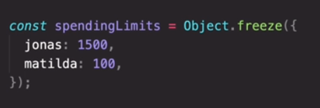

# Modern Javascript Modules

- [How we develop modern javascript applications](#how-we-develop-modern-javascript-applications)
- [Modules](#modules)
  - [What are modules?](#what-are-modules)
  - [What are dependencies?](#what-are-dependencies)
  - [Why use modules?](#why-use-modules)
  - [What are the differences between ES6 moduls, and regular script file](#what-are-the-differences-between-es6-moduls-and-regular-script-file)
  - [How ES6 modules are imported?](#how-es6-modules-are-imported)
    - [Why synchronous?](#why-synchronous)
- [Module Pattern](#module-pattern)
  - [What is the main goal of module Pattern?](#what-is-the-main-goal-of-module-pattern)
  - [How to do module Pattern](#how-to-do-module-pattern)
- [NPM](#npm)
  - [What Is npm?](#what-is-npm)
  - [Why to use npm?](#why-to-use-npm)
  - [why is that wrong?](#why-is-that-wrong)
- [Compare imperative vs declarative?](#compare-imperative-vs-declarative)
- [Technical](#technical)
  - [What is Parsing?](#what-is-parsing)
  - [CommonJs](#commonjs)
  - [How to make Object immutable ?](#how-to-make-object-immutable-)

## How we develop modern javascript applications

1. First we write our code as modules or pieces.
2. Then we use `bundlers` to collect our modules into one file
3. Then `Transpile , polyfilling` our code to work on all browsers
4. Then It goes to Production

## Modules

### What are modules?

- Small building blocks that when put together build complex applications
- Reusable piece of code that encapsulate implementation details
- can be a standalone file

### What are dependencies?

- modules that we import into our code, so that our code is `dependent on them`

### Why use modules?

1. abstract code
2. isolate each componenet
3. organized code
4. make code more reusable

### What are the differences between ES6 moduls, and regular script file

| `ES6 modules`                      | `Regular Scripts`                 |
| ---------------------------------- | --------------------------------- |
| variables scoped to module         | global variables                  |
| files load asynchronously          | synchronously unless defer, async |
| strict mode always                 | sloppy mode                       |
| always hoisted                     | not hoisted                       |
| Top-Level this refers to undefined | top level this refers to window   |
| allows imports and exports         | Doesn't allow                     |

### How ES6 modules are imported?

`First,` We [Parse](#what-is-parsing) all modules, Happens in [synchronous](#why-synchronous) way

#### Why synchronous?

1. So that we can hoist it
2. this way we know imports before execution
3. So that Bundlers can delete all pieces of code that are not used during execution.  
   `Then,` We Download the code of imports asynchronously  
   `After That`, We link our imports to exports of downloaded modules.  
   `Then`, We Execute our modules

Now it is ready to execute our main file  


## Module Pattern

### What is the main goal of module Pattern?

1. encapsulate functionality to
   1. Have private Date
   2. Expose public API

### How to do module Pattern

```JS
const objectIExport=(function(){
// type your code in here
// The IFEE Funciton will be destroyed
// I'll destory all the fields and return only the public Data I want to be exported
// using closure public data will be returned even if their execution context is destroyed
return{
	var1,
	fun2,
	fun3
}
})()
export objectIExport;
```

## NPM

### What Is npm?

1. node Package Manager
2. software
3. package repository

### Why to use npm?

in the past we use other Dependencies and packages by adding them to html

### why is that wrong?

- Because this way all global variables in external packages will defined in our package as well
- Some packages, need to be downloaded to your computer, This way it must be updated manually, so this will messy

## Compare imperative vs declarative?


## Technical

### What is Parsing?

Reading the code, without execution[need Update later]

### CommonJs

It is the style of import, export on the nodeJS server

### How to make Object immutable ?



- freeze make it immutable on first level only
